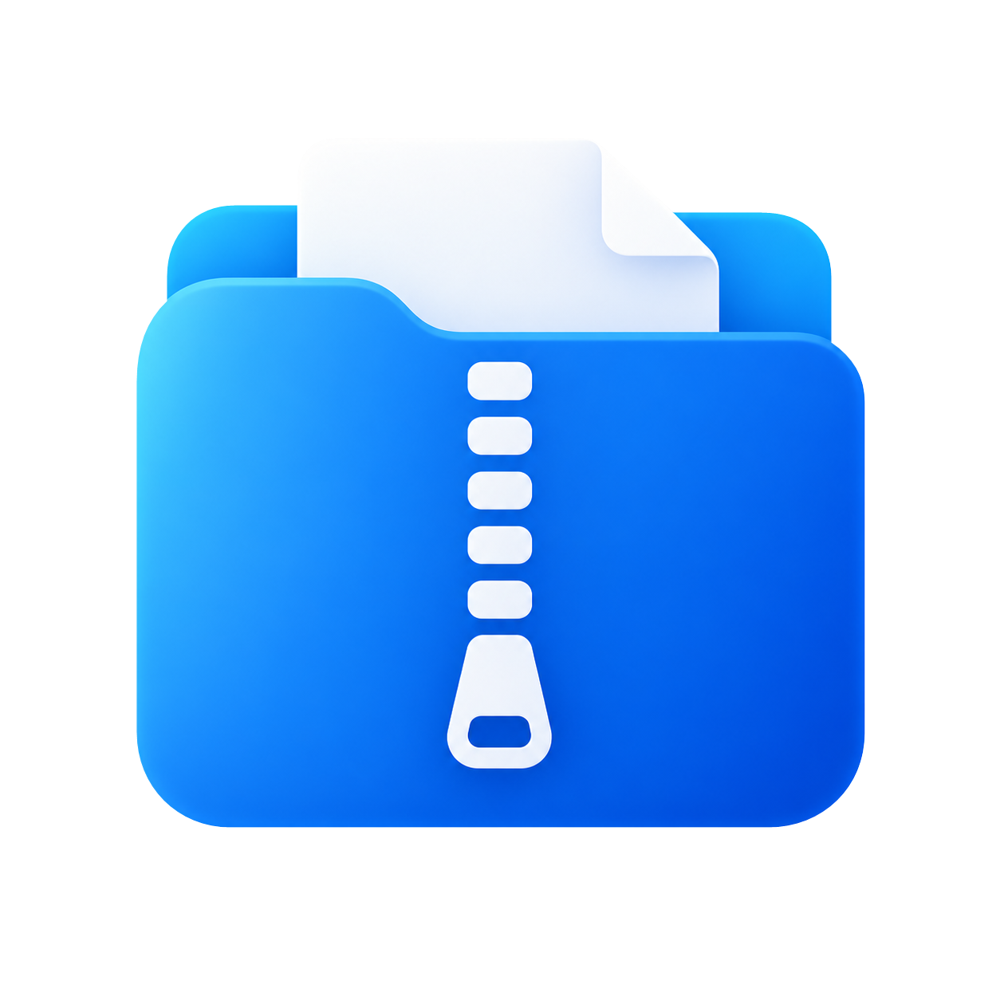

<p align="center">
  
</p>
<h1 align="center">SmartZip</h1>
<p align="center">Windows 11 第一層右鍵選單中的智慧解壓縮。</p>
<p align="center">
  
  <a href="docs/RELEASE.md"></a>
  <a href="docs/BUILD-0.1.0.15.md"></a>
  <a href="LICENSE"></a>
</p>
<p align="center">
  <a href="README.md">简体中文</a> · <a href="README.en.md">English</a> · <strong>繁體中文</strong> · <a href="README.ja.md">日本語</a>
</p>

## 功能

- **右鍵即可解壓縮**：選取壓縮檔，點選「智能解压」，不必開啟「顯示其他選項」。
- **內建解壓縮引擎**：不必另裝 7-Zip 或 WinRAR，可與既有壓縮軟體共存。
- **常用格式與多選**：支援 ZIP、RAR、7Z、CAB、TAR、GZ、GZIP、BZ2 及支援的數字分卷，亦支援中文、空格與特殊字元路徑。

## 取得與使用

**目前 `0.1.0.15` 為開發測試草稿，尚無公開安裝包。** 因此儲存庫首頁仍顯示未發行版本。[發行版頁面](https://github.com/yueyangcode/SmartZip/releases) · [發行狀態與校驗值](docs/RELEASE.md)

僅支援 **Windows 11 x64，Build 22621 或更新版本**。取得測試安裝包後：

1. 核對 SHA-256，執行 `SmartZipSetup-0.1.0.15-test.exe`。
2. 選擇上層目錄，安裝程式會加上 `SmartZip` 資料夾，僅為目前使用者安裝。
3. 在壓縮檔上按右鍵 → **智能解压**。設定與正常解除安裝入口位於開始功能表的 SmartZip 資料夾。

> **測試憑證：** 首次安裝須同意憑證助手要求系統管理員權限，僅將公開金鑰憑證加入 `LocalMachine\TrustedPeople`；不加入 Root，也不匯入私密金鑰。解除安裝依專案所有權處理，安裝前已有的憑證不接管。請勿停用 Windows 安全防護。

## 更新與限制

- 健康的舊測試版支援同目錄、同憑證升級；登錄不完整或解除安裝失敗時，請保留記錄並回報，不要強制清理。
- 目前沒有公共 WinGet 套件。更新器略過草稿與 Pre-release，發行測試版不會觸發更新提示。
- `.15` 的升級部署記錄已通過核驗，使用者確認新圖示與 ZIP 解壓縮正常。一般啟用 UAC 的環境及遠端更新流程仍待驗證。[驗收詳情](docs/SANDBOX-0.1.0.15-ACCEPTANCE.md)
- 多語言 README 不代表軟體已在地化；目前安裝程式與選單文字仍為簡體中文。

## 開發與授權

Windows 建置環境：PowerShell 7.4+、.NET SDK 8.0.425；主要使用 C++、C#、AutoHotkey。

```powershell
pwsh -File .\build.ps1 -Signing Test -Version 0.1.0.15
```

[建置說明](docs/BUILD-0.1.0.15.md) · [更新器設計](docs/UPDATER.md) · [回報問題](https://github.com/yueyangcode/SmartZip/issues)

本專案原始碼採用 [MIT](LICENSE) 授權。內建元件另有授權及原始碼提供要求，請見[第三方聲明](ThirdPartyNotices.md)。本專案以 [vvyoko/SmartZip](https://github.com/vvyoko/SmartZip) 為基礎，屬於獨立整合專案。
